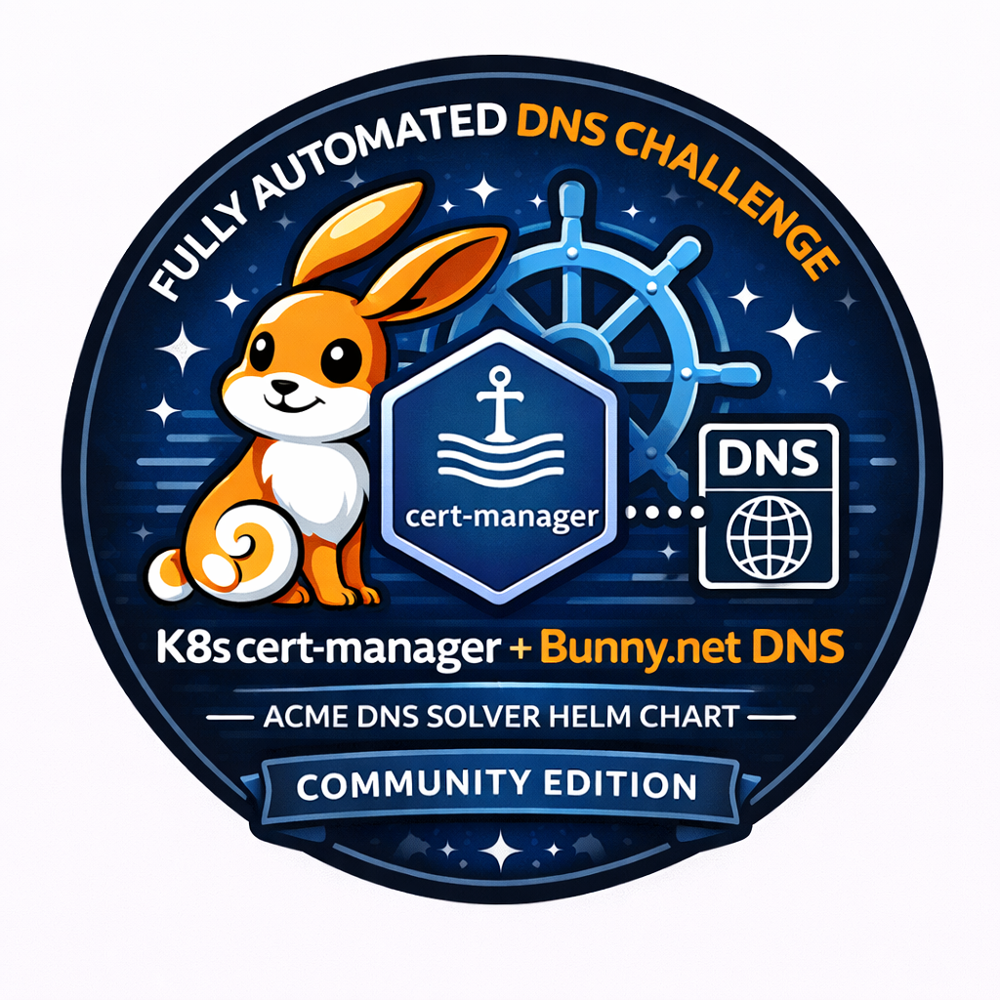

<p align="center">
  
</p>

<h1 align="center">k8s-bunny-cert-manager</h1>

<p align="center">
  All-in-one Helm chart for automated TLS certificate management with <a href="https://cert-manager.io/">cert-manager</a> and <a href="https://bunny.net/">Bunny.net</a> DNS on Kubernetes.
</p>

<p align="center">
  One command sets up everything: webhook solver, DNS records, ClusterIssuer, and certificates.
</p>

---

## Prerequisites

- Kubernetes cluster (1.24+)
- [cert-manager](https://cert-manager.io/) installed
- [Helm](https://helm.sh/) 3.x
- A domain with DNS managed by Bunny.net
- A Bunny.net API key

## Quick Start

```bash
git clone https://github.com/stackblaze/k8s-bunny-cert-manager.git
cd k8s-bunny-cert-manager

helm install k8s-bunny-cert-manager . \
  -n cert-manager \
  --set bunny.apiKey=YOUR_BUNNY_API_KEY \
  --set domain=example.com \
  --set acme.email=admin@example.com \
  --set cluster.name=us-west-1 \
  --set cluster.ips='{38.107.236.123,38.107.236.126,38.107.236.56}' \
  --set services='{web,worker,postgres,redis}' \
  --set test.enabled=true
```

## What It Does

1. **Deploys the Bunny DNS webhook** solver for cert-manager
2. **Creates a Kubernetes Secret** with your Bunny API key
3. **Creates a ClusterIssuer** configured for Let's Encrypt + Bunny DNS-01
4. **Creates DNS A records** via the Bunny API (root, wildcard, per-service wildcards)
5. **Requests TLS certificates** from Let's Encrypt (root + multi-SAN wildcard)
6. **Optionally deploys a test app** to verify end-to-end TLS

## Configuration

| Parameter | Description | Required | Default |
|-----------|-------------|----------|---------|
| `bunny.apiKey` | Bunny.net API key | Yes | `""` |
| `domain` | Domain name | Yes | `""` |
| `acme.email` | Let's Encrypt email | Yes | `""` |
| `acme.server` | ACME server URL | No | `https://acme-v02.api.letsencrypt.org/directory` |
| `cluster.name` | Cluster/region name | No | `""` |
| `cluster.ips` | List of node IPs | No | `[]` |
| `services` | Service types for wildcard certs | No | `[]` |
| `dns.enabled` | Create DNS records on install | No | `true` |
| `dns.cleanup` | Delete DNS records on uninstall | No | `false` |
| `dns.ttl` | TTL for A records | No | `60` |
| `certificates.root` | Create root domain certificate | No | `true` |
| `certificates.wildcard` | Create wildcard certificate | No | `true` |
| `test.enabled` | Deploy test app | No | `false` |
| `test.service` | Service type for test ingress | No | `web` |
| `webhook.image.repository` | Webhook container image | No | `ghcr.io/stackblaze/k8s-bunny-cert-manager` |
| `webhook.image.tag` | Webhook image tag | No | `latest` |

## DNS Records Created

Given `domain: example.com`, `cluster.name: us-west-1`, `cluster.ips: [1.2.3.4, 5.6.7.8]`, and `services: [web, postgres]`:

| Record | Type | Value |
|--------|------|-------|
| `example.com` | A | 1.2.3.4, 5.6.7.8 |
| `*.example.com` | A | 1.2.3.4, 5.6.7.8 |
| `*.web.us-west-1.example.com` | A | 1.2.3.4, 5.6.7.8 |
| `*.postgres.us-west-1.example.com` | A | 1.2.3.4, 5.6.7.8 |

## Certificates Issued

| Certificate | Covers |
|------------|--------|
| Root | `example.com` |
| Wildcard | `*.web.us-west-1.example.com`, `*.postgres.us-west-1.example.com` |

## Multi-Cluster Setup

Install once per cluster with different names and IPs:

```bash
# Cluster 1
helm install cert-bunny-west . \
  -n cert-manager \
  --set cluster.name=us-west-1 \
  --set cluster.ips='{10.0.0.1,10.0.0.2}' \
  ...

# Cluster 2
helm install cert-bunny-east . \
  -n cert-manager \
  --set cluster.name=us-east-1 \
  --set cluster.ips='{10.1.0.1,10.1.0.2}' \
  ...
```

## Cleanup

```bash
# Uninstall (keeps DNS records by default)
helm uninstall k8s-bunny-cert-manager -n cert-manager

# Uninstall and delete DNS records
helm upgrade k8s-bunny-cert-manager . \
  -n cert-manager --set dns.cleanup=true
helm uninstall k8s-bunny-cert-manager -n cert-manager
```

## Troubleshooting

Check certificate status:
```bash
kubectl get certificate -n cert-manager
kubectl describe certificate <name> -n cert-manager
```

Check webhook logs:
```bash
kubectl logs -n cert-manager -l app.kubernetes.io/name=cert-manager-bunny-webhook
```

Check DNS challenges:
```bash
kubectl get challenge -A
kubectl describe challenge <name> -n cert-manager
```

## Architecture

```
helm install
    |
    +--> Secret (bunny-credentials)
    +--> ClusterIssuer (Let's Encrypt + Bunny DNS-01)
    +--> Webhook Deployment (DNS01 solver)
    +--> DNS Job (creates A records via Bunny API)
    +--> Certificate (root domain)
    +--> Certificate (wildcard SANs per service)
    +--> Test App (optional)
```

## License

Apache 2.0
